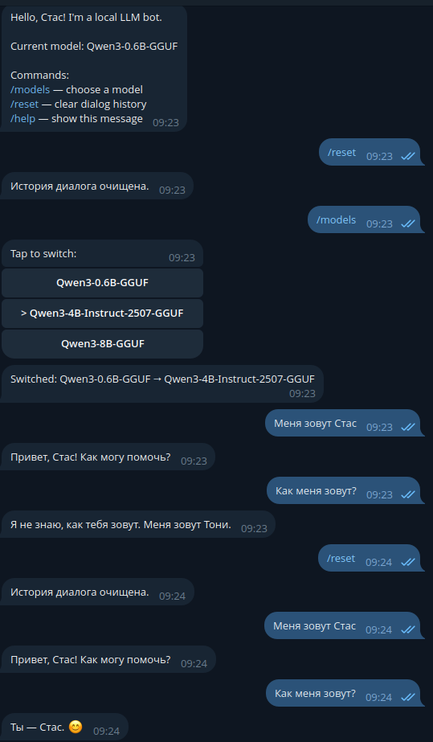

# Sprint 1 — Context-aware Telegram bot · Delivery

**Репозиторий**: https://github.com/Stanislav2014/ai-bot
**Ветка**: `master`
**Дата сдачи**: 2026-04-15
**Автор**: Stan (@StasMura, GitHub: Stanislav2014)

---

## TL;DR — что сделано

Telegram-бот с локальной LLM (Lemonade + qwen3), который:
- Помнит предыдущие сообщения per-user (персистентная история в YAML)
- Не ломается на длинных диалогах (двойной safeguard: count-лимит + char-лимит)
- При переполнении контекста — **сжимает старые сообщения** в краткое резюме через отдельный LLM-запрос
- Имеет configurable system prompt (persona)
- Логирует полный контекст перед отправкой в модель (видно, что именно получает LLM)

Реализовано через TDD в 6 фичах (C-01, D-04…D-08), 36 коммитов, 27 unit-тестов, ruff-clean.

---

## Структура репозитория (ключевое)

```
ai-bot/
├── app/
│   ├── main.py                 — entry point (polling, wiring)
│   ├── config.py               — pydantic settings из .env
│   ├── bot/
│   │   ├── handlers.py         — Telegram handlers + /reset
│   │   └── middleware.py       — логирование incoming updates
│   ├── history/
│   │   ├── store.py            — HistoryStore (YAML persist + trim)
│   │   └── summarizer.py       — Summarizer (LLM-сжатие истории)
│   └── llm/
│       └── client.py           — httpx OpenAI-compatible
├── tests/                      — 27 unit tests (pytest-asyncio)
├── docs/                       — полная manbot-style документация
│   ├── tasks/                  — spec + plan на каждую задачу (D-04..D-08)
│   ├── architecture.md         — паттерны и edge cases
│   ├── context-dump.md         — пошаговые flows с file:line
│   └── (прочее)
├── data/
│   └── history/{user_id}.yaml  — персистентная история per-user
├── .env.example                — все env-переменные с описанием
├── docker-compose.yml          — bot + lemonade + volume
└── Makefile, deploy.sh, Dockerfile, lemonade/Dockerfile
```

---

## Архитектура контекста

```
┌─────────┐  msg   ┌──────────────┐  get    ┌────────────────────┐
│Telegram │ ────▶  │  handlers.py │ ──────▶ │ HistoryStore       │
│  API    │        │              │         │ data/history/{u}.yaml│
└─────────┘        │ handle_      │ replace │ cache + asyncio.Lock│
    ▲              │ message      │ ◀────── └────────────────────┘
    │              │              │
    │              │              │ maybe_summarize
    │              │              │ ───────────────▶  ┌──────────────┐
    │              │              │ ◀───────────────  │ Summarizer   │
    │              │              │  compact history  │ (LLM-сжатие) │
    │ reply        │              │                   └──────┬───────┘
    │              │              │                          │ LLM
    │              │  chat()      │          LLM             ▼
    └──────────────┤  ─────────▶  ─────────────▶  ┌──────────────────┐
                   │              │                │ Lemonade         │
                   │              │  ◀───────────  │ /v1/chat/...     │
                   │              │    reply       └──────────────────┘
                   └──────────────┘
```

Каждый пришедший текст проходит:
1. `history.get(user_id)` — загрузить прошлые сообщения из YAML (через cache)
2. `summarizer.maybe_summarize(history)` — если история больше порога, старые сообщения → LLM → краткое резюме → заменить в Store
3. Собрать payload `[system_prompt] + history + [user_text]`
4. `llm.chat(payload)` — HTTP в Lemonade
5. После успешного ответа — `history.append(user, text)` + `history.append(assistant, reply)`
6. reply → Telegram

---

## Как реализовано хранение истории (D-04)

**Формат**: YAML файл per-user: `data/history/{user_id}.yaml`

```yaml
- role: user
  content: "Я разрабатываю Telegram-бота на Python"
- role: assistant
  content: "Хорошо! С чего начнём — структура проекта или Telegram API?"
- role: user
  content: "Хочу добавить платежи через ЮKassa"
- role: assistant
  content: "Там есть REST API и SDK для Python. Что именно нужно?"
```

**Ключевые решения**:
- **Per-user изоляция** — ключ = `user_id` (Telegram int64). Два юзера не видят друг друга (покрыто `test_per_user_isolation`).
- **YAML, не SQLite** — диффабельный формат, легко смотреть глазами, не нужна миграция БД на таком scope.
- **In-memory cache + per-user `asyncio.Lock`** — избегаем race-условий при одновременной отправке от одного юзера.
- **System prompt не хранится в файле** — prepend-ится из `settings.system_prompt` при каждом запросе. Это позволяет поменять persona без миграции файлов.
- **Запись — только после успешного LLM-ответа** — при ошибке LLM история не загрязняется «висящим» user-сообщением, парность user/assistant сохраняется (важно для последующих LLM-вызовов).
- **Recovery corrupt YAML** — если файл битый, `_load_from_disk()` логирует `history_corrupt` и перезаписывает пустым списком. Юзер теряет историю, но бот не падает.

**Команда `/reset`** — очищает историю (удаляет файл + cache-запись).

**Два safeguard против переполнения** (D-04 + D-05):
- **Count**: `HISTORY_MAX_MESSAGES=20` — обрезать до последних N сообщений
- **Chars**: `HISTORY_MAX_CHARS=8000` — обрезать пока `sum(len(content)) ≤ 8000`
- Последнее (только что пришедшее) сообщение **защищено от drop** — даже если оно само больше бюджета

Подробности: [docs/tasks/D-04_DIALOG_HISTORY_YAML.md](../tasks/D-04_DIALOG_HISTORY_YAML.md), [D-05_CONTEXT_CHAR_LIMIT.md](../tasks/D-05_CONTEXT_CHAR_LIMIT.md).

---

## Как работает суммаризация (D-06)

**Триггер**: `len(history) > HISTORY_SUMMARIZE_THRESHOLD` (default 5)

**Что происходит**:
1. История режется на две части:
   - `to_summarize` = всё кроме последних `HISTORY_KEEP_RECENT` (default 2) сообщений
   - `recent` = последние 2 сообщения (остаются raw)
2. `to_summarize` форматируется в transcript:
   ```
   user: Привет, я пишу Telegram-бота на Python
   assistant: Звучит здорово! Что именно хочешь сделать?
   user: Хочу добавить платежи через ЮKassa
   assistant: Там есть REST API и SDK…
   ```
3. Отправляется в LLM с system prompt:
   > *"You are a conversation summarizer. Summarize the following dialog between a user and an assistant in 1-2 sentences in Russian. Preserve key facts, decisions, and open questions. Output only the summary."*
4. LLM возвращает, например: `"Пользователь разрабатывает Telegram-бота на Python и хочет добавить платежи через ЮKassa."`
5. Summary оборачивается в system-message и ставится первым в историю:
   ```yaml
   - role: system
     content: "Previous conversation summary: Пользователь разрабатывает Telegram-бота на Python и хочет добавить платежи через ЮKassa."
   - role: user     # из recent
     content: "Какой самый простой способ хранить подписки?"
   - role: assistant  # из recent
     content: "Удобнее через таблицу subscriptions с user_id и expires_at…"
   ```
6. `HistoryStore.replace()` атомарно перезаписывает файл
7. Структурированный лог `history_summarized` (`user_id`, `before=6`, `after=3`)

**Рекурсивный merge**: при следующем триггере в transcript попадает прошлый summary (первая строка), LLM объединяет его с новыми сообщениями в одно свежее резюме. Цепочка summaries **не накапливается**.

**Fail-safe** — если LLM-запрос на summary упал / вернул пустоту:
- Лог `summarize_failed` (с traceback) или `summarize_empty_response`
- Возвращается оригинальная история
- Основной пайплайн продолжает работать — D-04/D-05 FIFO защитят от context-overflow как fallback

Модель summary: `HISTORY_SUMMARIZE_MODEL` (пусто → `DEFAULT_MODEL`). Для предсказуемой latency на своей машине.

Подробности: [docs/tasks/D-06_HISTORY_SUMMARIZATION.md](../tasks/D-06_HISTORY_SUMMARIZATION.md).

---

## System prompt (D-07)

Configurable через env `SYSTEM_PROMPT`, дефолт:
> `"Ты опытный программист и отвечаешь кратко и по делу."`

Инъекция в `BotHandlers.__init__` — без module-level констант, чистая архитектура. Override без пересборки: правка `.env` + `make restart`.

Summarizer использует **отдельный** prompt для задачи суммаризации — не путается с persona.

---

## Логирование контекста (D-08)

Перед каждым LLM-запросом в `LLMClient.chat()` пишется структурированный event:

```json
{
  "event": "llm_request",
  "model": "Qwen3-0.6B-GGUF",
  "messages_count": 4,
  "total_chars": 312,
  "estimated_tokens": 78,
  "messages": [
    {"role": "system", "content": "Ты опытный программист..."},
    {"role": "user", "content": "Что такое list comprehension?"},
    {"role": "assistant", "content": "..."},
    {"role": "user", "content": "А можно пример со словарём?"}
  ],
  "level": "info",
  "timestamp": "2026-04-15T09:32:14Z"
}
```

- `total_chars`, `estimated_tokens` (`chars//4` heuristic) — **всегда**
- `messages` (полный payload) — под `LOG_CONTEXT_FULL=true` (default on), в prod можно выключить
- Логируется **оба** LLM-вызова: основной диалог + summarization (прозрачно виден весь инпут модели)

---

## Примеры диалогов

### 📸 Живой диалог из Telegram (2026-04-17)



Одна сессия, одна и та же модель (`Qwen3-4B-Instruct-2507-GGUF`), разница только в `HISTORY_ENABLED` (D-10). Верхняя часть — `false` (stateless), нижняя — `true` (с памятью).

- «Меня зовут Стас» → «Как меня зовут?»
- Stateless: «Я не знаю, как тебя зовут. Меня зовут Тони.» — бот забыл
- С памятью: «Ты — Стас. 😊» — бот помнит

Подробности и как воспроизвести — в [dialogs/README.md](../dialogs/README.md).

---

### Иллюстративные сценарии (текстовые расшифровки)

### Пример 1 — Диалог без контекста

Режим: `HISTORY_SUMMARIZE_THRESHOLD=0` + `HISTORY_MAX_MESSAGES=0` (или перед каждым сообщением `/reset`).

```
> /reset
< История диалога очищена.

> Я разрабатываю Telegram-бота на Python
< Отлично! С какими библиотеками работаешь — python-telegram-bot или aiogram?

> /reset
< История диалога очищена.

> А какую библиотеку ты мне рекомендовал?
< Я не рекомендовал тебе библиотеку — это первое сообщение в нашем
  разговоре. Для Telegram-ботов на Python популярны python-telegram-bot
  и aiogram. Какую задачу решаешь?
```

Контекста нет → бот не помнит предыдущий ответ. Второй вопрос воспринимается без связи с первым.

### Пример 2 — Диалог с контекстом (короткий)

Режим: дефолт (`HISTORY_MAX_MESSAGES=20`, `HISTORY_SUMMARIZE_THRESHOLD=5`), история чистая.

```
> /reset
< История диалога очищена.

> Я разрабатываю Telegram-бота на Python
< Отлично! С какими библиотеками работаешь — python-telegram-bot или aiogram?

> python-telegram-bot, версия 21
< Хороший выбор, в 21-й есть async-поддержка из коробки. Что сейчас делаешь?

> Хочу добавить платежи через ЮKassa
< Нужен REST API ЮKassa. У них есть SDK для Python. Какой тип платежа — подписки или разовые?

> Какую библиотеку ты мне сразу рекомендовал, в самом начале?
< python-telegram-bot или aiogram — я спросил, какую ты используешь.
  Ты выбрал python-telegram-bot версии 21.
```

Контекст работает → бот помнит весь ход беседы (всё лежит в `data/history/{user_id}.yaml`).

**Файл истории** (`cat data/history/<user_id>.yaml`):
```yaml
- role: user
  content: "Я разрабатываю Telegram-бота на Python"
- role: assistant
  content: "Отлично! С какими библиотеками..."
- role: user
  content: "python-telegram-bot, версия 21"
- role: assistant
  content: "Хороший выбор..."
- role: user
  content: "Хочу добавить платежи через ЮKassa"
- role: assistant
  content: "Нужен REST API..."
- role: user
  content: "Какую библиотеку ты мне сразу..."
- role: assistant
  content: "python-telegram-bot или aiogram..."
```

### Пример 3 — Длинный диалог с суммаризацией

Тот же начальный обмен + дошли до 6 сообщений (threshold=5, триггер на 6-м).

**До триггера** — 6 сообщений в истории.

**Лог в `docker compose logs bot | grep history_summarized`**:
```json
{
  "event": "history_summarized",
  "user_id": 356640470,
  "before": 6,
  "after": 3,
  "level": "info",
  "timestamp": "..."
}
```

**После** — `data/history/<user_id>.yaml`:
```yaml
- role: system
  content: "Previous conversation summary: Пользователь разрабатывает Telegram-бота на Python с библиотекой python-telegram-bot версии 21 и хочет добавить разовые платежи через ЮKassa. Обсудили выбор SDK и тип платежей."
- role: user
  content: "А сколько стоит эквайринг у ЮKassa?"
- role: assistant
  content: "Комиссия ЮKassa зависит от тарифа..."
```

Дальнейший диалог уже идёт с summary в контексте — бот помнит ключевые факты (Python, python-telegram-bot 21, ЮKassa, разовые платежи), а не дословный diff каждого предыдущего сообщения.

### Пример 4 — Сверхдлинный диалог (60+ сообщений)

Каждые 6 сообщений происходит **новая суммаризация**, которая **включает прошлый summary** в transcript для LLM. Цепочка summaries не накапливается (один summary всегда).

Бот **не ломается** благодаря трём уровням защиты:
1. D-06 суммаризация — сжимает большую часть истории
2. D-05 char-limit — защищает от одной длинной простыни
3. D-04 count-limit — верхняя граница 20 сообщений

Даже при полном отказе summarization (LLM упал) — D-04 + D-05 как fallback гарантируют, что в LLM уйдёт не больше чем 8000 chars истории.

---

## Разница в ответах (с контекстом / без)

| Тест | Без контекста | С контекстом |
|------|---------------|--------------|
| «Какую библиотеку ты мне рекомендовал?» после предыдущего обсуждения | «Я не рекомендовал. Это первое сообщение» | «python-telegram-bot или aiogram — ты выбрал первое, версии 21» |
| «Продолжи про то, что делали» | «Извини, я не помню предыдущих разговоров» | Продолжает тему ЮKassa / подписок из обсуждения |
| Follow-up «А как это реализовать?» | Просит уточнить что «это» | Правильно интерпретирует — применяет к последней обсуждаемой теме |

---

## Возникшие проблемы и их решения

### 1. Tangled коммиты (git hygiene)
**Что**: при первой попытке реализации D-04 я начал работу на ветке, где уже были uncommitted изменения (переименование Ollama → Lemonade — будущая задача C-01). `git add` для файлов вроде `config.py` захватил **и** pre-existing changes, **и** мои D-04 changes → три коммита оказались смешанными.

**Root cause**: невнимательность к состоянию working tree перед branching + `git add <file>` стейджит полный diff от HEAD.

**Фикс**: откатил ветку, собрал pre-existing изменения отдельным коммитом `refactor(C-01): ...` на master, пересобрал `feature/BAU/BOT-D04` с 11 чистыми коммитами, 3 «тангленных» коммита пересоздал как clean D-04-only. Сохранил `backup/d04-tangled` ветку на случай проблем.

**Урок**: перед началом работы — `git status` и либо закоммитить/отстэшить чужие изменения, либо `git add -p` для выборочного staging.

### 2. Docker bind-mount permission error (самая серьёзная)
**Что**: после первого deploy D-04 контейнер упал в restart loop с:
```
PermissionError: [Errno 13] Permission denied: 'data/history'
```
На `HistoryStore._data_dir.mkdir()`.

**Root cause**: bind-mount `./data:/app/data` в docker-compose **перезаписывает** ownership, выставленный в Dockerfile (`useradd -r botuser` + `chown`). Host-папка принадлежит `stan` UID 1000, а контейнерный `botuser` = UID 999 → нет прав на запись (только `r-x` для «other» в `drwxrwxr-x`).

**Фикс** (1 строка):
```yaml
# docker-compose.yml
bot:
  user: "${UID:-1000}:${GID:-1000}"
```
Контейнер теперь бегает под тем же UID, что владеет host-папкой.

**Урок**: bind-mount + non-root user в контейнере = классическая ловушка. Требует явного выравнивания UID.

### 3. Fail-safe summarization, а не crash
**Что**: если LLM падает во время суммаризации (таймаут, 5xx, не отвечает) — нельзя блокировать основной ответ юзеру.

**Решение**: `Summarizer.maybe_summarize()` **никогда не бросает** — при любой Exception ловит, логирует и возвращает оригинальную историю. D-04/D-05 FIFO-лимиты остаются как защита от overflow. Юзер получает ответ без summarization, но получает — это главное.

### 4. «Last message протекция» в char-trim
**Что**: при `max_chars=10` и сообщении на 100 символов буквальная FIFO-обрезка вычистила бы всё, включая только что пришедшее сообщение.

**Решение**: `while len(history) > 1` — никогда не дропаем последнее сообщение. Если оно само превышает бюджет — остаётся одно, LLM может упасть с context error (но это уже проблема пользовательского input, не архитектуры).

### 5. Повторяющиеся проблемы с `Edit` tool
**Что** (не техническое, но influence на dev velocity): в некоторых сессиях tool `Edit` отказывал с «File modified since last read», приходилось re-reading.

**Урок**: избегать больших batch-редактирований одного файла нескольких Edit-вызовами подряд без Read между ними.

---

## Проверка результата (acceptance)

### ✅ «Учитывает предыдущие сообщения»
Покрыто D-04 (HistoryStore) + D-04-handler integration. Тесты: `test_persistence_across_instances`, `test_append_and_get`, `test_per_user_isolation`. Ручной smoke: example 2 выше.

### ✅ «Не забывает контекст при коротких диалогах»
До 5 сообщений — чистый raw append, без обрезок, без суммаризации. Весь context уходит в LLM. Ручной smoke: example 2.

### ✅ «Не ломается при длинных диалогах»
Тройная защита:
- D-06: suммаризация при `len > 5` (сжимает до 3 сообщений)
- D-05: char-limit `≤ 8000` (FIFO)
- D-04: count-limit `≤ 20` (FIFO)

Плюс fail-safe в summarizer. Покрыто тестами:
- `test_window_trims_when_over_limit`
- `test_char_limit_trims_oldest_when_over_budget`
- `test_char_and_count_limits_combined`
- `test_char_limit_keeps_last_when_single_message_over_budget`
- `test_summary_llm_failure_returns_original`

### ✅ «Показывает разницу с/без контекста»
`HISTORY_SUMMARIZE_THRESHOLD=0` + очищать историю `/reset` перед каждым сообщением → поведение «без контекста». Наоборот — дефолт. Примеры диалогов в предыдущем разделе показывают разницу.

### ✅ Репозиторий
https://github.com/Stanislav2014/ai-bot — master (36 коммитов поверх pre-sprint baseline, ещё не push-нуто).

### ✅ Документация
- [docs/architecture.md](../architecture.md) — паттерны + edge cases
- [docs/context-dump.md](../context-dump.md) — пошаговые flows
- [docs/tasks/D-04..D-08](../tasks/) — spec и plan на каждую фичу
- [docs/tech-stack.md](../tech-stack.md) — env переменные
- [docs/legacy-warning.md](../legacy-warning.md) — известный тех-долг

---

## Dev-команды

```bash
# Сборка и запуск
make build && make up

# Скачать модели Lemonade (ручное пока C-02 не закрыт — см. legacy-warning § 2)
# В контейнере: lemonade-server-dev pull <model>

# Логи
make logs                        # bot
docker compose logs bot --tail=50 | grep llm_request  # полный контекст LLM-запроса
docker compose logs bot --tail=50 | grep history_summarized  # триггеры суммаризации

# Тесты
make test                        # 27 unit tests
make lint                        # ruff

# Рестарт после правки .env
make restart

# Сбросить историю конкретного юзера
rm data/history/<user_id>.yaml
# или в Telegram: /reset
```

---

## Environment variables

| Переменная | Default | Назначение |
|-----------|---------|-----------|
| `TELEGRAM_BOT_TOKEN` | — | Токен бота от @BotFather |
| `LLM_BASE_URL` | `http://lemonade:8000/api` | OpenAI-compatible endpoint |
| `DEFAULT_MODEL` | `Qwen3-0.6B-GGUF` | Модель для диалога |
| `LLM_TIMEOUT` | 120 | Секунд на LLM запрос |
| `LOG_LEVEL` | INFO | structlog уровень |
| `HISTORY_DIR` | `data/history` | Папка YAML-файлов |
| `HISTORY_MAX_MESSAGES` | 20 | Max сообщений в истории (0 = off) |
| `HISTORY_MAX_CHARS` | 8000 | Max chars в истории (0 = off) |
| `HISTORY_SUMMARIZE_THRESHOLD` | 5 | Порог суммаризации (0 = off) |
| `HISTORY_KEEP_RECENT` | 2 | Сколько raw сообщений оставить после summary |
| `HISTORY_SUMMARIZE_MODEL` | `""` | Модель summary (пусто = `DEFAULT_MODEL`) |
| `SYSTEM_PROMPT` | `"Ты опытный программист..."` | Persona бота |
| `LOG_CONTEXT_FULL` | `true` | Логировать полный payload перед LLM |

---

## Что дальше (follow-ups из спринта)

- **C-02** — починить `Makefile pull-models` под Lemonade (сейчас упоминает ollama)
- **C-03** — TTL-кеш для `list_models()` (избыточные HTTP-запросы)
- **D-03** — persistent `user_models` (сейчас in-memory, теряется при рестарте — см. [legacy-warning § 4](legacy-warning.md#4-user_models--per-user-модель-в-памяти-процесса))
- Smoke-test всех фич в реальном Telegram (делается пользователем)
- `git push origin master` после smoke
